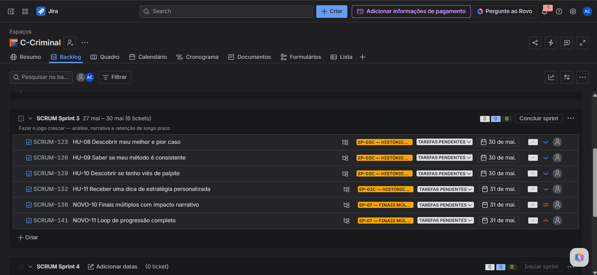
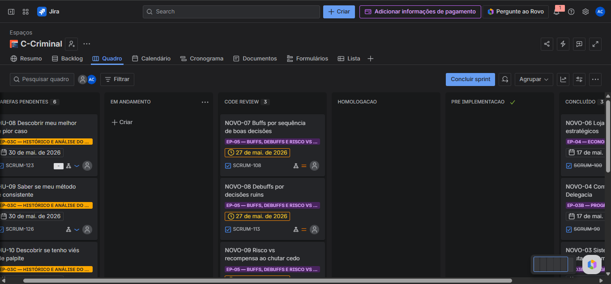
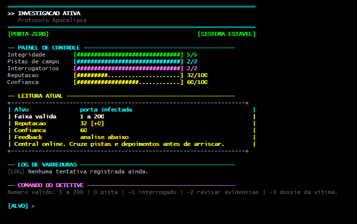

# Investigação Criminal: C-Criminal


Este projeto transcende um simples "jogo de adivinhação" no terminal. Trata-se de um **Simulador de Investigação Criminal e Motor de Análise Forense**, desenvolvido inteiramente em Linguagem C. O sistema é dividido em duas grandes frentes operacionais: a simulação interativa de coleta de pistas e um *Pipeline* de Dados capaz de traçar o perfil comportamental do detetive.

---

## Diferenciais Técnicos (Engenharia de Software e Dados)

Não construímos apenas um jogo, construímos um sistema com inteligência aplicada:
* **Terminal Imersivo e Validação de Entrada:** Interface rica em cores ANSI, com sistema de validação robusto que impede que letras ou valores fora do escopo quebrem a investigação, garantindo uma UX contínua.
* **Persistência de Dados e Histórico:** O sistema salva automaticamente (em arquivos `.txt`) cada movimento do jogador de forma invisível, criando um banco de dados de sessões para análise futura.
* **Recursividade e Estatística:** O cálculo do Desvio Padrão das investigações — usado para medir a consistência do método do detetive — é feito aplicando algoritmos em C para extrair inteligência dos dados brutos.
* **Profiling de Viés Cognitivo:** Detecção automática se o jogador tem a tendência inicial de superestimar ou subestimar pistas, gerando alertas no Dossiê Final.
* **Mentoria Dinâmica de Estratégia:** O sistema calcula a média de tentativas e, se o desempenho for ruim, ensina táticas de programação e raciocínio lógico (como a Busca Binária) usando o linguajar do universo policial.

---

## Os Casos (Dificuldades)

O jogo possui três níveis de complexidade, cada um com sua própria história, cenário e consequências para a cidade:

1. **Caso 01: O Último Suspiro do Magnata (Fácil | 1 a 50 | 7 Tentativas)**
   * *Alvo:* A assinatura de calor deixada pelo assassino "Alinho do Goitá" no cofre do bilionário Gaga de Big Field, antes que a digital desapareça do teclado numérico.
2. **Caso 02: Frequência de Fuga no Cassino (Médio | 1 a 100 | 6 Tentativas)**
   * *Alvo:* A frequência de rádio criptografada da gangue do "môpretu" no assalto em Santo Amaro. É preciso achar a frequência exata antes que o helicóptero de fuga chegue.
3. **Caso 03: Protocolo Apocalipse (Difícil | 1 a 200 | 5 Tentativas)**
   * *Alvo:* A porta de rede infectada pelo malware do cyber-terrorista "CH do Pina". Se a porta não for descoberta pelo Agente Abedalama, a rede elétrica do estado entrará em colapso.

---

## Equipe e Papéis (Scrum)

Nossa equipe (5 pessoas) foi dividida estrategicamente para garantir entregas de valor contínuo:

1. **Alisson Santana - Líder Técnico:** Responsável pela arquitetura, integração dos módulos e revisão de código.
2. **Danilo Diniz - Desenvolvedor:** Foco no núcleo do jogo (lógica de tentativas, validação de entrada, geração do número).
3. **Gabriel Andrade - Desenvolvedor:** Foco na persistência (salvar e carregar o histórico em arquivo).
4. **Carlos Henrique - Product Owner:** Responsável por garantir que o produto faz sentido, priorizar o backlog e manter o grupo alinhado com o que precisa ser entregue.
5. **Arthur Abelardo - Desenvolvedor:** Foco nos algoritmos de análise (desvio padrão, viés, dossiê).

---

## Organização e Metodologia Ágil (Entrega 01)

O desenvolvimento segue práticas de metodologias ágeis, organizando o escopo em **2 Grandes Épicos**. Todas as **12 Histórias de Usuário (HU)** foram escritas estritamente no **Padrão 3Cs** (Card, Conversation, Confirmation).

### Épico 1: Sistema de Pista na Investigação (Transacional)
O core do jogo. O jogador atua como detetive, enfrentando cenários com pistas temáticas que crescem conforme a dificuldade.
* **HU-01:** Escolha do caso e dificuldade.
* **HU-02:** Submissão e validação segura de palpites.
* **HU-03:** Recebimento de pistas temáticas (Maior/Menor contextualizado).
* **HU-04:** Lógica de resolução (Vitória) ou falha (Derrota).
* **HU-05:** Sistema de pontuação e rank narrativo.
* **HU-06:** Interface imersiva no terminal com ANSI Colors.

### Épico 2: Análise Forense do Histórico (Analítico)
Módulo pós-jogo focado no tratamento de dados e geração de *insights* baseados nas partidas passadas.
* **HU-07:** Salvamento automático da sessão (Data Logger).
* **HU-08:** Mapeamento de picos de desempenho (Melhor/Pior caso).
* **HU-09:** Cálculo de consistência do método investigador.
* **HU-10:** Profiling e detecção de viés de palpite inicial.
* **HU-11:** Sugestão algorítmica de estratégia (Busca Binária).
* **HU-12:** Geração do Dossiê Completo consolidado na tela.

---

## Artefatos de Engenharia e Design

Para garantir a qualidade técnica e visual antes da codificação, documentamos a arquitetura de interação e o fluxo de dados.

### Prototipação e UI/UX
Desenvolvemos a fidelidade visual e a jornada de interação do usuário utilizando o Figma.
* **[Acessar Protótipo Interativo no Figma](https://www.figma.com/make/Qeu9UfYyMf8QrbvotMCLWp/Sem-t%C3%ADtulo?p=f&fullscreen=1)**
* **Demonstração do Protótipo:**
*(Para visualizar o vídeo de demonstração, [clique aqui e baixe o arquivo de vídeo](./assets/video/demonstracao-prototipo.mp4) ou assista diretamente no [link do vídeo no youtube](https://youtu.be/zq3WFZ6LRZw?si=vvPPmwpWL8_6_A4W).)*

### Fluxo Lógico e Processos
O comportamento das Histórias de Usuário foi mapeado previamente para garantir que a lógica em C cobriria todos os caminhos felizes e tratamentos de erro.
* **[Visualizar Diagramas de Atividades das User Stories (Google Drive)](https://drive.google.com/drive/folders/1Ie-Q5i_qO5cq70D5H5UGpyAtHMfGOyR5)**

---

## Evidências de Planejamento (Board Ágil)

Toda a gestão de tarefas, Sprints e divisão de responsabilidades foi orquestrada via Jira Software.
* **[Acessar Board Público no Jira](https://cesar-team-xjfwas8s.atlassian.net/jira/software/projects/SCRUM/boards/1)**

> **Visão do Quadro Kanban** <br>
> *O fluxo de trabalho estruturado nas colunas: Tarefas Pendentes, Em Andamento, Code Review, Homologação, Pré-implementação e Concluído.*
> 
> 

> **Visão do Backlog Priorizado** <br>
> *As 12 histórias ordenadas e divididas por responsável para a Sprint 01.*
> 
> 


---

# Entrega 03 — Evolução do Sistema

Durante a Sprint 02, o projeto evoluiu da estrutura base de investigação para um sistema mais estratégico e dinâmico, adicionando novas mecânicas de progressão, risco e recompensa para o jogador.

## Funcionalidades Implementadas na Sprint 02

### Sistema de Reputação Investigativa
O jogador agora possui um nível de reputação que varia conforme seu desempenho durante os casos. Decisões mais eficientes aumentam a credibilidade do investigador, enquanto falhas frequentes reduzem sua reputação.

### Sistema de Buffs
O sistema concede vantagens temporárias ao jogador quando boas decisões são tomadas durante a investigação, incentivando estratégias mais eficientes.

### Sistema de Debuffs
Penalidades são aplicadas quando o jogador toma decisões ruins ou acumula erros excessivos, aumentando o desafio e tornando cada caso mais imprevisível.

---

## Organização da Sprint 02

A Sprint 02 teve foco na expansão da experiência do jogador, adicionando mecânicas de progressão, consequências e aprofundamento estratégico.

### Backlog da Sprint 02



### Board da Sprint 02 e 03



---

## Evidência das Funcionalidades

### Gameplay da Sprint 02



---

## Programação em Par (Pair Programming)

| Integrantes | Atividade |

| Arthur Abelardo + Danilo Diniz | Desenvolvimento e testes do card de implementação da loja de itens |


---

## Testes de Sistema

Os testes foram realizados manualmente em múltiplos cenários para garantir estabilidade e consistência das novas funcionalidades.

| Cenário de Teste | Resultado |

| Sistema de reputação funcionando corretamente | ✅ |
| Aplicação de buffs durante a investigação | ✅ |
| Aplicação de debuffs em decisões ruins | ✅ |
| Tratamento de entradas inválidas | ✅ |
| Salvamento automático da sessão | ✅ |
| Finalização completa da investigação | ✅ |

---

## Screencast da Entrega 03

- Organização da Sprint no Jira
- Atualização do Board
- Funcionalidades implementadas
- Execução do sistema
- Estrutura do repositório

---

---

## Como Executar o Projeto

O sistema não requer dependências externas. Para compilar e rodar:

1. Clone o repositório:
```bash
git clone [https://github.com/arthurabelardo-dev/C-Criminal.git](https://github.com/arthurabelardo-dev/C-Criminal.git)
